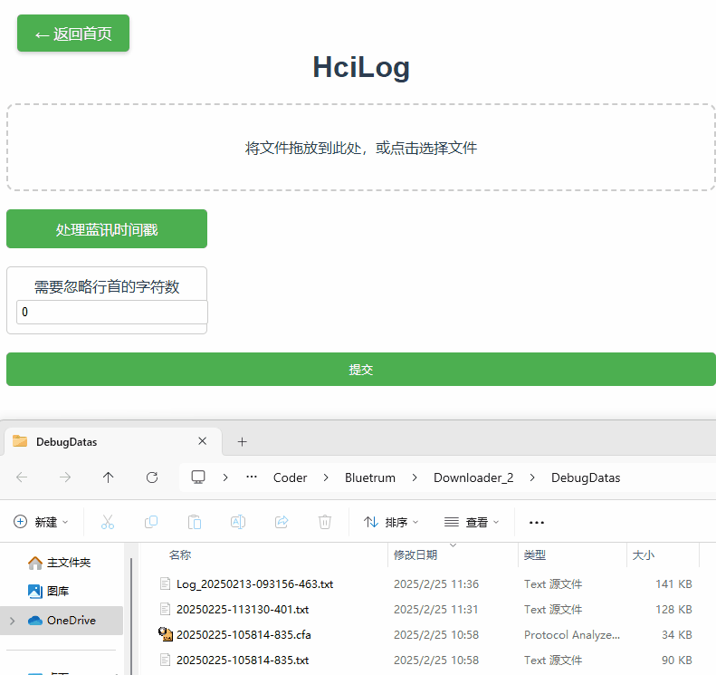

# 工具使用帮助文档 0.3.1
## 线程分析工具

1. 上传日志文件
    - 将日志文件拖放到页面中央的 **文件拖放区域**，或点击选择文件。
2. 预处理文件
    - 点击 **"预处理"** 按钮，工具会对日志文件进行初步处理。
    - 处理完成后，页面会显示一组复选框选项，需要在这边选择线程对应的type头
3. 生成图表
    - 点击 **"提交"** 按钮，工具会根据预处理结果生成可视化图表。
    - 图表会显示在页面下方的 **图表区域**，您可以通过鼠标悬停、缩放和拖动查看详细信息。
4. 返回首页
    - 点击左上角的 **"返回首页"** 按钮，退出当前页面。

### 注意事项
- 确保上传的文件是有效的日志文件。
- 预处理是生成图表的前提步骤，请务必先进行预处理。

### 测试数据

test\test_analyze_thread.txt

预处理之后，选择 `tswi`，点击提交，可以看到图表

## 异常日志处理页面使用帮助

1. **拖放文件**：将文件拖放到页面中的文件拖放区域，或点击选择文件。
2. **提交文件**：点击“提交”按钮，系统会处理文件。
3. **查看结果**：处理完成后，CPU寄存器信息将显示在页面下方。

## HciLog 帮助信息

1. 拖放文件到页面中。
2. 点击“提交”按钮以处理文件。
3. 处理完成后，您将看到结果。

## 测试数据
- test\test_hcilog_bluetrum_ts.txt
- test\test_hcilog_skip_chars.txt
